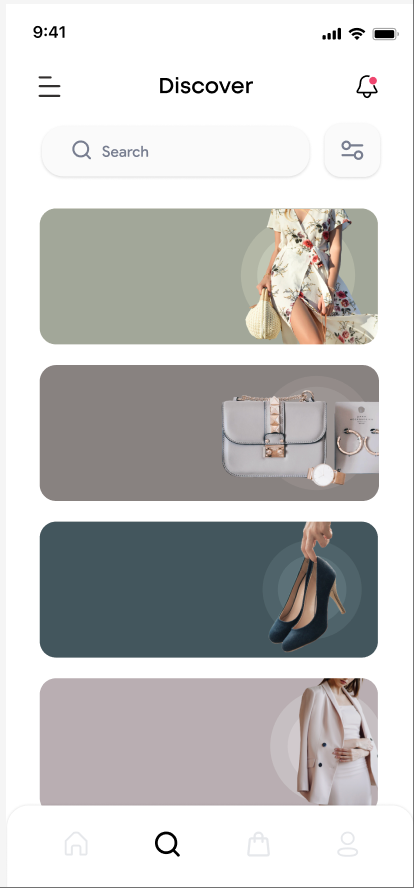

# Simple Shop - Kotlin Multiplatform App

A modern e-commerce mobile application built with **Kotlin Multiplatform** and **Compose Multiplatform**, targeting both Android and iOS platforms with a single codebase.


## FigmaInput

https://www.figma.com/design/zw8e35BtXmY5jOznBJeWYD/Simple_Shop_1?node-id=0-1



## 🚀 Features

- **Cross-platform UI**: Shared UI components using Compose Multiplatform
- **Modern Design**: Clean, minimalist design with Material 3 components
- **Category Browsing**: Browse products by categories (Clothing, Accessories, Shoes)
- **Search & Filter**: Integrated search and filter functionality
- **Responsive Layout**: Optimized for different screen sizes
- **Native Performance**: Compiles to native code for both platforms

## 📱 Screenshots

The app features a discover screen with:
- Status bar with time and system indicators
- Header with menu and notification icons
- Search bar with filter functionality
- Category cards with product images
- Bottom navigation tab bar

## 🛠 Tech Stack

- **Kotlin Multiplatform**: Cross-platform development
- **Compose Multiplatform**: Shared UI framework
- **Material 3**: Modern design system
- **Gradle**: Build system with Kotlin DSL
- **Android**: Target SDK 35, Min SDK 24
- **iOS**: Support for iOS Simulator and ARM64 devices

## 📋 Prerequisites

- **Android Studio** (latest version)
- **Xcode** (for iOS development)
- **JDK 11** or higher
- **Kotlin 2.2.0**
- **Gradle 8.7.3**

## 🚀 Getting Started

### 1. Clone the Repository

```bash
git clone <repository-url>
cd Figma_MCP_SimpleShop
```

### 2. Open in Android Studio

Open the project in Android Studio. The IDE will automatically sync the Gradle files.

### 3. Run on Android

1. Connect an Android device or start an emulator
2. Click the "Run" button in Android Studio
3. Or run from command line:
   ```bash
   ./gradlew :composeApp:androidDebug
   ```

### 4. Run on iOS

1. Open the `iosApp/iosApp.xcodeproj` in Xcode
2. Select your target device or simulator
3. Click "Run" in Xcode

## 📁 Project Structure

```
Figma_MCP_SimpleShop/
├── composeApp/                    # Main Compose Multiplatform module
│   ├── src/
│   │   ├── androidMain/          # Android-specific code
│   │   ├── commonMain/           # Shared code for all platforms
│   │   │   ├── kotlin/
│   │   │   │   └── com/example/simpleshop/
│   │   │   │       ├── App.kt   # Main app composable
│   │   │   │       └── ...
│   │   │   └── composeResources/ # Shared resources
│   │   └── iosMain/             # iOS-specific code
│   └── build.gradle.kts         # Module build configuration
├── iosApp/                       # iOS application
│   └── iosApp/
│       ├── iOSApp.swift         # iOS app entry point
│       └── ContentView.swift    # SwiftUI wrapper
├── build.gradle.kts             # Root project configuration
└── gradle/
    └── libs.versions.toml       # Dependency versions
```

## 🎨 UI Components

The app includes several reusable Compose components:

- **StatusBar**: System status indicators
- **Header**: App header with navigation
- **SearchBar**: Search and filter functionality
- **CategoryCards**: Product category display
- **BottomTabBar**: Navigation tabs

## 🔧 Development

### Adding New Features

1. **Shared Code**: Add to `composeApp/src/commonMain/kotlin/`
2. **Platform-Specific**: Use `androidMain/` or `iosMain/` folders
3. **Resources**: Add to `composeApp/src/commonMain/composeResources/`

### Building

```bash
# Build for all platforms
./gradlew build

# Build for Android only
./gradlew :composeApp:androidDebug

# Build for iOS only
./gradlew :composeApp:iosSimulatorArm64Debug
```

## 📦 Dependencies

Key dependencies include:
- **Compose Multiplatform**: UI framework
- **Material 3**: Design system
- **AndroidX Lifecycle**: Lifecycle management
- **Kotlin Test**: Testing framework

## 🤝 Contributing

1. Fork the repository
2. Create a feature branch
3. Make your changes
4. Add tests if applicable
5. Submit a pull request

## 📄 License

This project is licensed under the MIT License - see the LICENSE file for details.

## 🔗 Resources

- [Kotlin Multiplatform Documentation](https://kotlinlang.org/docs/multiplatform.html)
- [Compose Multiplatform](https://www.jetbrains.com/lp/compose-multiplatform/)
- [Material 3 Design](https://m3.material.io/)

---

Built with ❤️ using Kotlin Multiplatform and Compose Multiplatform